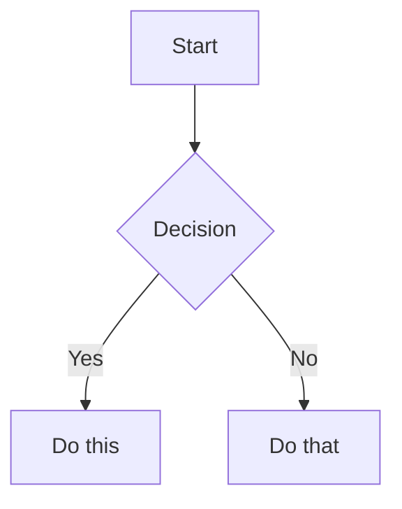

# Obsidian Flavored Markdown Reference

Obsidian extends CommonMark and GFM with wikilinks, embeds, callouts, properties,
comments, and other syntax. Standard Markdown (headings, bold, italic, lists,
quotes, code blocks, tables) is assumed.

## Internal Links (Wikilinks)

```markdown
[[Note Name]]                          Link to note
[[Note Name|Display Text]]             Custom display text
[[Note Name#Heading]]                  Link to heading
[[Note Name#^block-id]]                Link to block
[[#Heading in same note]]              Same-note heading link
```

Define a block ID by appending `^block-id` to any paragraph:

```markdown
This paragraph can be linked to. ^my-block-id
```

For lists and quotes, place the block ID on a separate line after the block:

```markdown
> A quote block

^quote-id
```

## Embeds

Prefix any wikilink with `!` to embed its content inline:

```markdown
![[Note Name]]                         Embed full note
![[Note Name#Heading]]                 Embed section
![[image.png]]                         Embed image
![[image.png|300]]                     Embed image with width
![[document.pdf#page=3]]               Embed PDF page
```

See [EMBEDS.md](EMBEDS.md) for audio, video, search embeds, and external images.

## Callouts

```markdown
> [!note]
> Basic callout.

> [!warning] Custom Title
> Callout with a custom title.

> [!faq]- Collapsed by default
> Foldable callout (- collapsed, + expanded).
```

Common types: `note`, `tip`, `warning`, `info`, `example`, `quote`, `bug`,
`danger`, `success`, `failure`, `question`, `abstract`, `todo`.

See [CALLOUTS.md](CALLOUTS.md) for the full list with aliases, nesting,
and custom CSS callouts.

## Properties (Frontmatter)

```yaml
---
title: My Note
date: 2024-01-15
tags:
  - project
  - active
aliases:
  - Alternative Name
cssclasses:
  - custom-class
---
```

Default properties: `tags` (searchable labels), `aliases` (alternative note names
for link suggestions), `cssclasses` (CSS classes for styling).

See [PROPERTIES.md](PROPERTIES.md) for all property types, tag syntax rules,
and advanced usage.

> When choosing between wikilinks and Markdown links: use `[[wikilinks]]` for
> notes within the vault (Obsidian tracks renames automatically) and
> `[text](url)` for external URLs only.

## Tags

```markdown
#tag                    Inline tag
#nested/tag             Nested tag with hierarchy
```

Tags can contain letters, numbers (not first character), underscores, hyphens,
and forward slashes. Tags can also be defined in frontmatter.

## Comments

```markdown
This is visible %%but this is hidden%% text.

%%
This entire block is hidden in reading view.
%%
```

## Obsidian-Specific Formatting

```markdown
==Highlighted text==
```

## Math (LaTeX)

```markdown
Inline: $e^{i\pi} + 1 = 0$

Block:
$$
\frac{a}{b} = c
$$
```

## Diagrams (Mermaid)

````markdown

````

To link Mermaid nodes to Obsidian notes, add `class NodeName internal-link;`.

## Footnotes

```markdown
Text with a footnote[^1].

[^1]: Footnote content.

Inline footnote.^[This is inline.]
```

## References

- [Obsidian Flavored Markdown](https://help.obsidian.md/obsidian-flavored-markdown)
- [Internal links](https://help.obsidian.md/links)
- [Embed files](https://help.obsidian.md/embeds)
- [Callouts](https://help.obsidian.md/callouts)
- [Properties](https://help.obsidian.md/properties)
