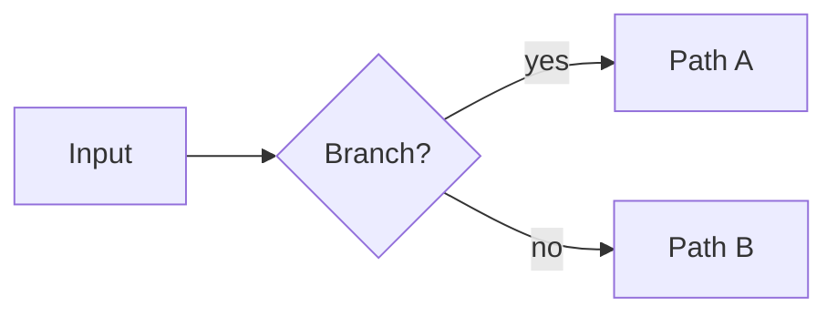

# Research

Dual-mode documentation skill. Detect which mode applies from the input:

- **Generator mode** — a topic, concept, or question is given → produce a structured explanation
- **Formatter mode** — existing markdown content is pasted or referenced → reformat it to spec

---

## Mode: Generator

### Step 0 — Topic Scoping (in-band, before any research)

If the topic is **broad, ambiguous, or undefined**, do not proceed to research. Instead, use
`AskUserQuestion` to scope it in one structured prompt:

- **Angle/subtopics**: theory, implementation, tradeoffs, history — which do you care most about?
- **Depth**: Overview (high-level mental model) / Working knowledge (enough to use it) / Deep dive (internals and edge cases)
- **Audience**: Novice (no background) / Practitioner (familiar with the domain) / Expert (deep specialist)
- **Exclusions**: any adjacent concepts to explicitly skip?

Collect answers before moving to Step 1. For well-scoped topics, skip straight to Step 1.

---

### Step 1 — Preliminary Research + Planning

Run a **quick, broad sweep** before committing to a research plan. Goal: discover the topic
surface, not understand it deeply.

- Use lightweight tools (WebSearch, WebFetch on overview pages, skim abstracts)
- Identify the key subtopics, terminology clusters, and open questions
- Note which areas are sparse, contested, or require primary sources
- Time-box this phase — it should feel like a scout, not a study session

After the sweep, call `EnterPlanMode` and **present a research plan to the user** before executing it:

```
Topics identified:
  1. [topic A] — [why it matters, what needs verifying]
  2. [topic B] — ...
  ...

Proposed agents:
  - Agent 1: [role/focus] → covers topics [X, Y]
  - Agent 2: [role/focus] → covers topics [Z]
  - ...

Parallelizable: [yes/no and why]
Estimated depth per agent: [skim / standard / deep dive]
```

**Ask the user to confirm or adjust** the plan before proceeding. Prompt them on:
- Whether to add, remove, or merge agents
- Whether any topic needs more or less depth
- Whether agents should run in parallel (breadth-first) or sequentially (each informs the next)

Only proceed to Step 2 after explicit confirmation. Call `ExitPlanMode` once the user confirms.

---

### Step 2 — Research Execution

Execute the confirmed plan. For each agent in the approved plan, call `TaskCreate` (one task per
agent, named after its focus area) before dispatching. Call `TaskUpdate` (status `completed`) as
each agent returns.

Launch agents per the approved configuration.

**Agent orchestration rules:**
- Parallel agents: use when topics are independent — each agent gets a focused scope and returns
  a structured summary
- Sequential agents: use when understanding topic A is prerequisite to scoping topic B — chain
  them and pass output forward
- Specialist agents preferred over generalist sweeps — give each agent a tight mandate
- Each agent should return: key facts, notable sources (URLs or paper titles), open questions,
  and confidence level on contested claims

Synthesize agent outputs before writing the final document. Do not copy-paste raw agent output —
integrate, deduplicate, and resolve conflicts.

---

### Step 3 — Write the Document

Produce a structured explanation of the given topic. Use this output structure (include a section
only if the topic warrants it — don't add empty or padding sections):

1. **Summary** — one plain-English paragraph, no jargon, explains what and why
2. **Diagram** — see diagram rules below
3. **Core explanation** — section(s) walking through the concept in depth
4. **Math** — if the topic is math-heavy; see LaTeX rules below
5. **Pseudocode** — if the topic involves an algorithm, process, or implementation; see rules below
6. **Gotchas / key takeaways** — non-obvious behavior, common mistakes, edge cases
7. **References** — footnotes at the bottom; see citation rules below

---

## Mode: Formatter

Given existing markdown content, restructure it to match the generator output structure and apply
all formatting rules below. Do not invent content — only reorganize and enrich what's present.
If a section has no corresponding content, omit it.

### Formatter Guardrails

Formatter mode is a **lossless transformation**, not a summarization step.

Required invariants:

- Preserve **all substantive findings, claims, caveats, recommendations, comparisons, and named
  entities** from the source
- Preserve **all examples, enumerated lists, tables, and source references** unless the user
  explicitly asks to trim them
- Preserve the original document's stance and confidence. Do not soften, narrow, or generalize
  claims during cleanup
- It is acceptable to split, merge, or rename sections for readability, but not to drop material
  that carried meaning in the original

Before rewriting, build a compact mental checklist of source content:

1. Main findings / conclusions
2. Comparisons and tradeoffs
3. Security warnings, risks, and edge cases
4. Implementation details, parameters, and examples
5. Reference inventory (papers, specs, repos, blog posts, tables)

After rewriting, run a parity pass against that checklist:

- Verify every original finding still appears in the output
- Verify every item in a source table/list is still present unless intentionally merged without loss
- Verify references were not silently dropped when converting inline links to footnotes
- If information cannot be placed naturally in the new structure, keep it in a dedicated section
  rather than omitting it

When the user says the formatted output should be "the same file", "same findings", "same
content", or similar, treat that as a hard requirement for **near-identity of substance**. In that
case:

- Prefer over-inclusion to omission
- Keep long reference sections intact, even if they are not stylistically ideal
- Keep repository comparison tables and appendix material unless the user explicitly approves
  removing them
- If a formatting improvement would require compressing content, do not make that change

---

## Formatting Rules

### Diagrams

Use a diagram when it genuinely reduces cognitive load — not as decoration.

**Use for:** architecture, dataflow, state machines, sequences, decision trees, hierarchy,
before/after comparisons.

**Skip for:** simple lists, single-concept definitions, short how-tos with fewer than 3 steps.

**Format:** Prefer Mermaid (renders in Obsidian). Use ASCII art when the content will be read in
a terminal or nvim without a renderer. When in doubt, use Mermaid and note it requires a renderer.



### LaTeX Math

Use Obsidian MathJax notation. Inline: `$expression$`. Block: `$$\nexpression\n$$`.

Rules:
- Define every variable before or immediately after introducing it
- Follow every math expression — inline or block — with a plain-English sentence or paragraph
  that explains what it means intuitively, not just symbolically
- Target reader: smart person with no math background. Prioritize intuition over rigor.
- Never use LaTeX for things that aren't actually mathematical expressions

Example pattern:

> The probability of an event is given by $P(A) = \frac{|A|}{|S|}$, where $|A|$ is the number
> of outcomes in event $A$ and $|S|$ is the total number of possible outcomes.
>
> In plain terms: divide the number of ways your thing can happen by the total number of things
> that could happen.

### Pseudo-JS Pseudocode

Use when the topic involves an algorithm, multi-step process, math implementation, or protocol.

Style: JS-shaped but loose. Skip boilerplate (no `require`, no `module.exports`, no type
annotations). Use plain English inside function bodies where internal logic is complex or
conceptual. The goal is clarity, not correctness.

Always label with `// pseudocode` at the top of the block so it's not mistaken for runnable code.

```js
// pseudocode
function exampleAlgorithm(input):
  result = []
  for each item in input:
    if item meets condition → process and push to result
    else → skip
  return result
```

Prefer named functions with clear parameter names over anonymous logic.

### Citations and Footnotes

Source every external fact, formula, named concept, or claim. Use Obsidian footnote syntax:

- Inline marker: `[^1]` placed immediately after the claim
- Definition at the bottom of the document: `[^1]: https://example.com — Brief description`

Rules:
- If a source is uncertain or unverifiable from memory, say so explicitly — never fabricate a URL
- Ask the user before launching sub-agents to verify citations
- Group all footnote definitions at the very end of the document under a `## References` header
- Number footnotes sequentially from `[^1]`
- In formatter mode, citations are a **representation change only**. Converting links/sections to
  footnotes must not reduce the source inventory from the original document
- If the source document contains a dedicated reading list, bibliography, repo table, or appendix
  of references, preserve it as content in addition to footnotes when needed for parity
